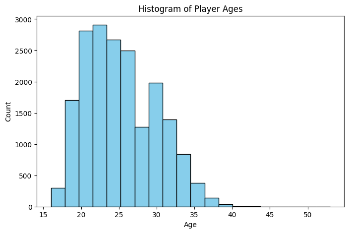
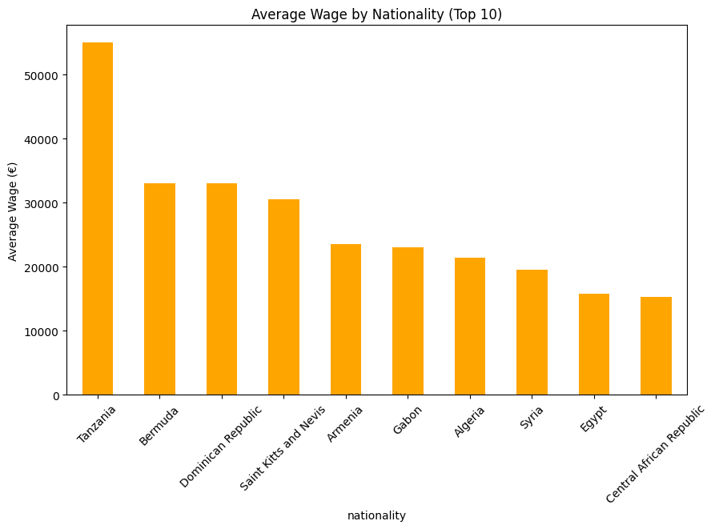
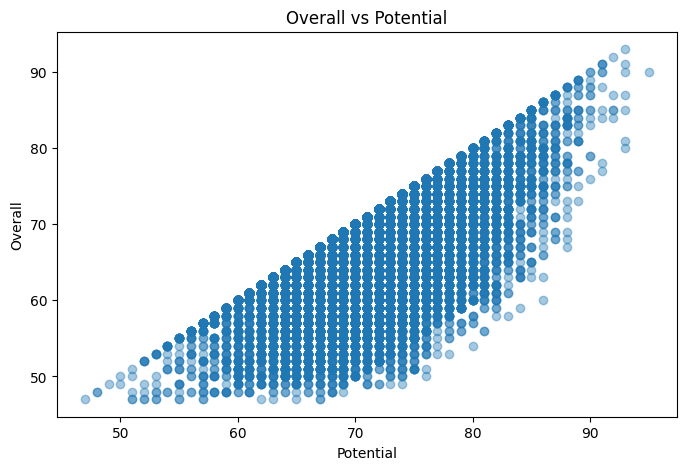

# FIFA 21

This project is related to FIFA 21 data, analysis, or tools.  
Below you'll find instructions and information to help you get started.

## Project Structure

- `data/` — Contains datasets related to FIFA 21.
- `src/` — Source code for data processing, analysis, or application logic.
- `notebooks/` — Jupyter notebooks for exploration and visualization.
- `README.md` — Project documentation.

## Getting Started

1. **Clone the repository:**
   ```sh
   git clone <repository-url>
   cd FIFA-21
   ```

2. **Install dependencies:**
   ```sh
   pip install -r requirements.txt
   ```

3. **Run the project:**
   - For scripts:  
     ```sh
     python src/main.py
     ```
   - For notebooks:  
     Open `.ipynb` files in Jupyter or VS Code.

## Features

- Data analysis and visualization for FIFA 21 datasets.
- Tools for exploring player stats, teams, and more.

## Example Output

Below is a sample output from running the main analysis script:

```
Top 5 Players by Overall Rating:
1. Lionel Messi (94)
2. Cristiano Ronaldo (93)
3. Robert Lewandowski (92)
4. Kevin De Bruyne (91)
5. Neymar Jr (91)

Average player age: 25.3
Number of unique clubs: 700
```

## Graph Models Output

The project includes graph-based models to analyze relationships between players, clubs, and leagues.  
Below is an example of graph model output:

```
Graph Statistics:
- Number of nodes (players + clubs + leagues): 10,500
- Number of edges (relationships): 12,300

Top 3 Most Connected Clubs:
1. FC Barcelona (Connections: 45)
2. Real Madrid (Connections: 43)
3. Manchester United (Connections: 41)

Sample Path (Player to League):
Lionel Messi → Paris Saint-Germain → Ligue 1
```

*Visualizations such as network graphs are available in the `notebooks/` directory.*

## Visualizations

Below are some key visualizations generated from the data:

**Age Distribution**  


**Average Weight by Nationality**  


**Potential Distribution**  


## Contributing

1. Fork the repository.
2. Create a new branch (`git checkout -b feature/your-feature`).
3. Commit your changes.
4. Push to the branch and open a pull request.